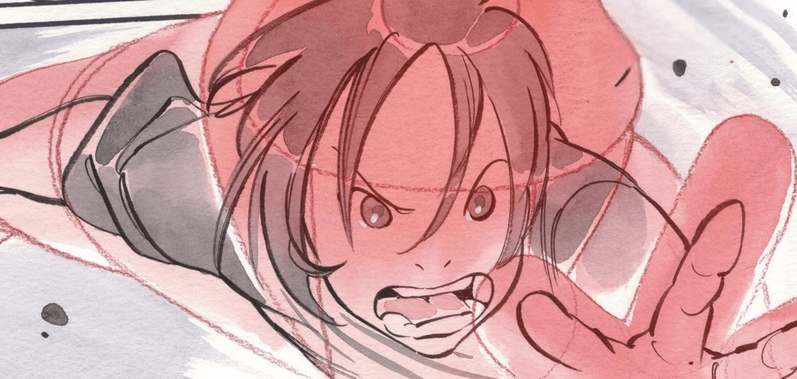

<header align='left'>
    <h1>Yuri Teixeira</h1>
</header>

    

 

    
    

<main>
    <section>
        <h2>Sobre mim</h2>
        
Estudante de informática pelo IFRN. Interessado pelo desenvolvimento back-end e arquitetura de sistemas. Tenho gosto por aprender de forma autônoma e aplicar meus conhecimentos.

        
Um elemento essencial do meu cotidiano, além do computador, é a música, especialmente algo mais calmo ou introspectivo.

    </section>
    <section>
        <h2>Tech stack</h2>
        <table align="center">
            <tr>
                <th style="border: 2px solid white;">Categoria</th>
                <th style="border: 2px solid white;">Ferramenta</th>
            </tr>
            <tr>
                <td style="border: 1px solid white;">Linguagens</td>
                <td style="border: 1px solid white;">Python, Java, Golang</td>
            </tr>
            <tr>
                <td style="border: 1px solid white;">Frameworks</td>
                <td style="border: 1px solid white;">Django, Flask, Spring, Playwright</td>
            </tr>
            <tr>
                <td style="border: 1px solid white;">Banco de dados</td>
                <td style="border: 1px solid white;">MySQL/MariaDB, Redis</td>
            </tr>
            <tr>
                <td style="border: 1px solid white;">Arquitetura</td>
                <td style="border: 1px solid white;">Domain driven design,  event driven architecutre</td>
            </tr>
            <tr>
                <td style="border: 1px solid white;">Deploy</td>
                <td style="border: 1px solid white;">Vercel, Docker</td>
            </tr>
        </table>
    </section>
</main>

<h2 align="left">Ouvindo agora</h2>

    

